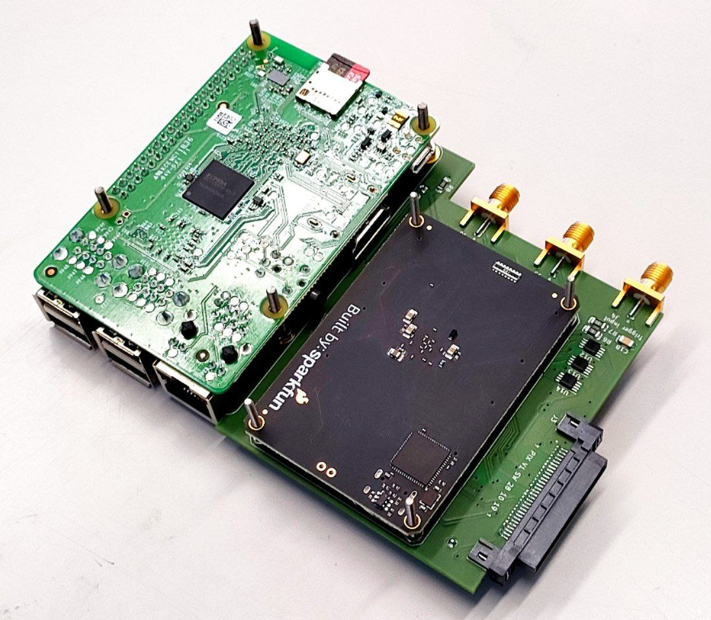
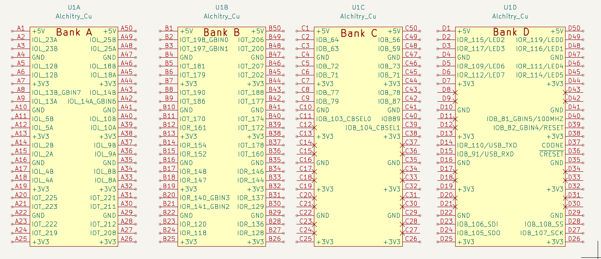
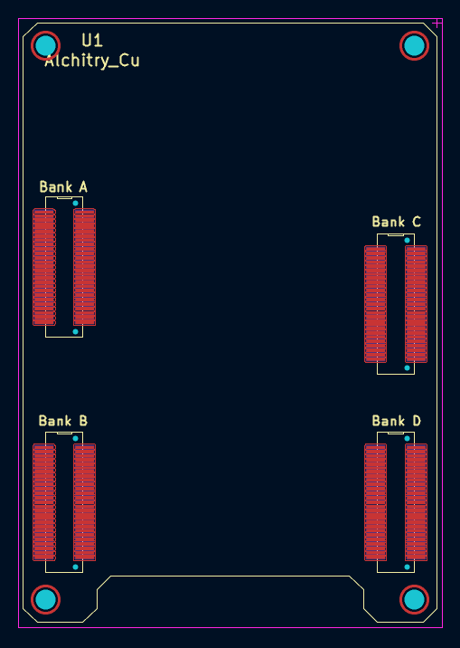
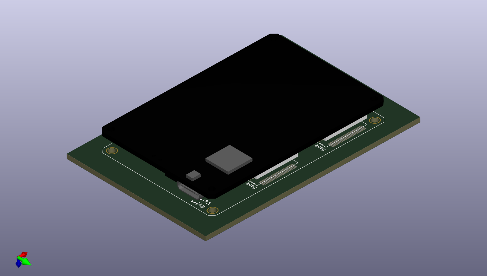

# Alchitry Cu KiCAD library

Include this file into your project and use the [Alchitry Cu](https://alchitry.com/boards/cu) as another component in you board, easy to use FPGA. It was tested (i.e. manufactured) and dimensions are fine, everything fits:

The **connectors** you need to buy are "manufactured by" SparkFun and have manufacturer number *PRT-16890*, I bought them [here](https://www.mouser.ch/ProductDetail/SparkFun/PRT-16890?qs=W%2FMpXkg%252BdQ4TqQaMVApRFA%3D%3D).

The library includes the schematic symbol

and the PCB footprint

as well as the 3D part for CAD design

